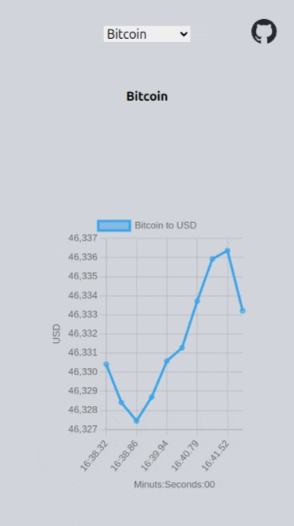

# Realtime Crypto information
A usecase of websocket in a single page application, which shows updates from the back-end, without requests from the front-end.

See it [Live](https://noviceguru.github.io/live-crypto-prices/).

<p align="center">
  
</p>

# Why Crypto
The market is open 24/7, unlike stock market that is open only during working hours and working days, so the live example can be working.

# The API
A great shout to the [Public Apis](https://github.com/public-apis/public-apis) project, they should have what you need.

Free WebSocket connections are rare and limited. I used [Finnhub](https://finnhub.io/)'s API which I found the most available and reliable among the others, although it does not allow more than one connection at the time, which means if two users have the web application open, only one of them would have access to the live data. I thought it was enough for a showcase.

Also, my initial plan was to show multiple graphs at the same time, which due to this limitation, wasn't possible.

# How to run
Using your favorite package manager (I used `pnpm`), install the dependencies and run `run dev`.
For example:

```
pnpm install
pnpm run dev
```